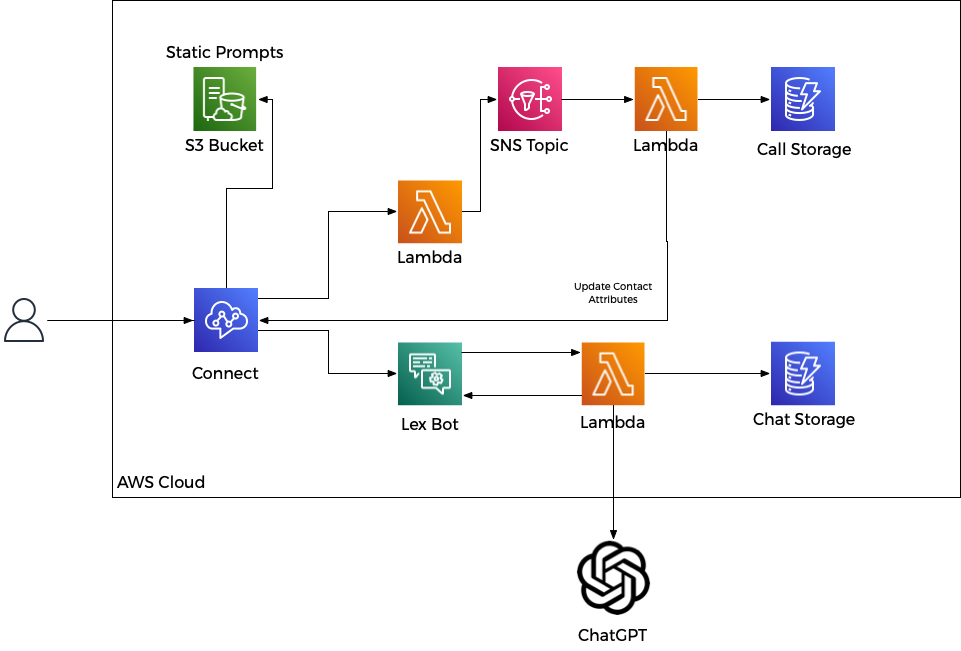
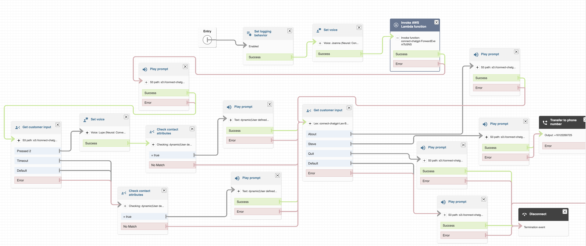
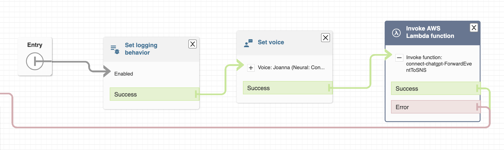
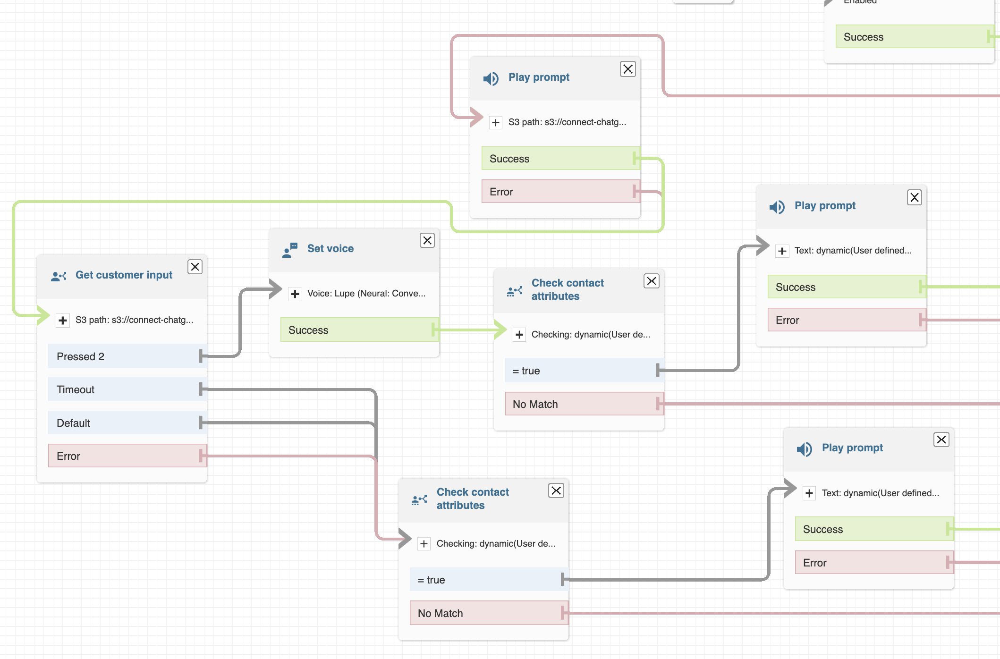
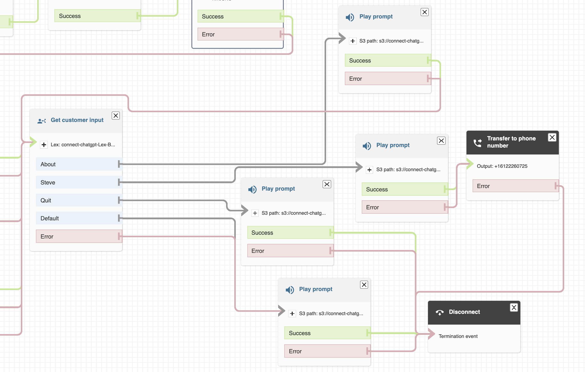
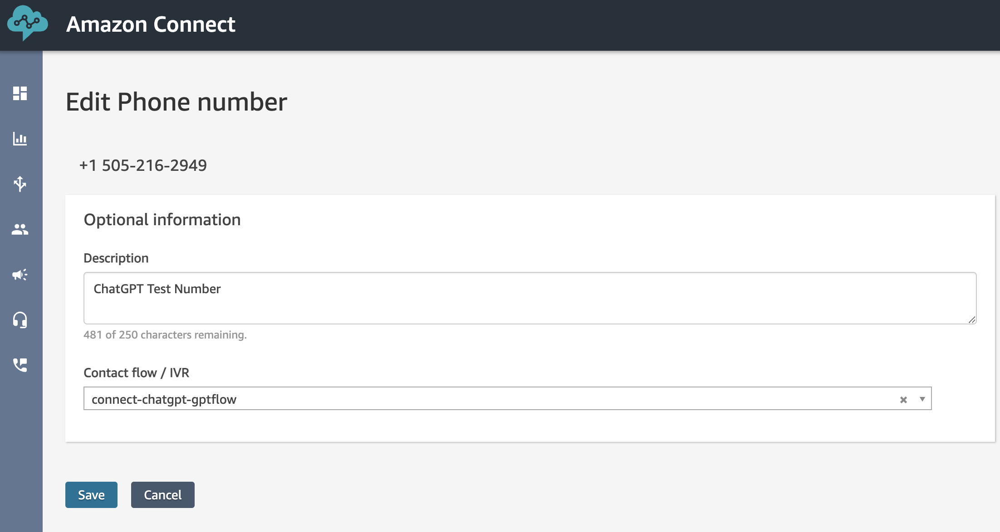

# AWS Connect ChatGPT Voice Bot via Lex in Java

## Background

This project demonstrates an integration of [Amazon Connect](https://aws.amazon.com/pm/connect/) to [OpenAI ChatGPT](https://openai.com/product/chatgpt) in both English and Spanish via 
an [AWS Lex Bot](https://aws.amazon.com/pm/lex/).  There are some examples out there in NodeJS and Python that demonstrate a basic integration with some screen shots, but not a fully working 
example (with chat context) that can be easily deployed via CloudFormation, including the call flow itself and the glue to bring it together with minimal console interaction.

The basic strategy is to deploy a normal LexV2 Bot with intents to handle a couple cases (like help, talk to someone, and hanging up on the caller) and use the 
[AMAZON.FallbackIntent](https://docs.aws.amazon.com/lexv2/latest/dg/built-in-intent-fallback.html) with a [Lambda CodeHook](https://docs.aws.amazon.com/lexv2/latest/dg/paths-code-hook.html) 
to send requests to ChatGPT and also maintain the Chat session so you can interact just like the web client.  An example being, you ask "What is the biggest lake in MN", then subsequently 
you ask "how deep is it".  Because all your prompts are saved to a [Dyanamo DB Table](https://aws.amazon.com/dynamodb/) as you interact, the context is maintained and ChatGPT knows the 
context of each question.  The project uses your callerID and today's date for session context.  So you can ask a question, hang up, then call back, and ChatGPT will still have the context 
of what you said in the prior call.  When you call the next day, you are starting with a fresh context.

Because tearing down and building Connect instances is rate limited and can lock you out for 30 days, you will need to pass in an instance ID of an existing Amazon Connect instance to deploy 
this project.  You will also need to allocate a phone number and associate it with the created call flow.  You can of course use an existing phone number in your instance and temporarily point 
it at the "connect-chatgpt-gptflow".  If you are deploying this, the assumption would be you are familiar enough with Amazon Connect to bring up an instance and allocate a phone number or you 
already have an existing instance.  You will also need an [OpenAI API key](https://platform.openai.com/account/api-keys) saved to [Parameter Store](https://docs.aws.amazon.com/systems-manager/latest/userguide/systems-manager-parameter-store.html) 
(OPENAI_API_KEY is the default in the template).


Other Features:
- Use of [Static Prompts](https://docs.aws.amazon.com/connect/latest/adminguide/setup-prompts-s3.html) defined in the CloudFormation itself.  
  Polly is fast inside Connect, but I just have to believe longer static prompts from S3 will provide lower latency for playback.
- Background lookup of call data that doesn't block the call flow waiting on a result.
- Multilingual support.  Spanish and English are supported, but another language supported by Lex and ChatGPT should be easy to implement.
- Lex Intents
  - About/Help - Static prompt the describes the project
  - Transfer - Transfer the call to a person (or mention the first name configured in the template)
  - Hang Up - Play a good bye prompt and terminate the call when caller indicates they are done


Other goals of the project (technical focus):
- SAM CloudFormation for all the components in play (`sam build` and then `sam deploy`) for simple deployment of the project.
- Use of the to be released [V4 Java Event Objects](https://github.com/aws/aws-lambda-java-libs/tree/85837fa301a83f89bbb09683c35aa5df1077b7d4) instead of dealing with raw JSON for LexV2 Events
- Use of the [Dynamo DB Enhanced client](https://docs.aws.amazon.com/sdk-for-java/latest/developer-guide/ddb-en-client-doc-api.html) to save Java Objects
- Generate Prompts with Polly and use SOX to convert them in a Lambda (a project in and of itself!)
- Use of [SnapStart](https://docs.aws.amazon.com/lambda/latest/dg/snapstart.html) to reduce latency (which is important for a voice interface) on Lambda Functions
- Dynamic Creation of the Connect Flow based on CloudFormation
- To simply provide a full working example with Java well structured using the best available API's
  - [openai-java](https://github.com/TheoKanning/openai-java)

## Architecture

### High Level Components


### Call Flow


### Initial Call to Lambda
When the call arrives at the Connect Call Flow we call a Lambda Function:
- This lambda function simply takes the Connect Event payload and puts it onto an SNS Topic
- This is a short NodeJS code block that is intended to quickly return and not perform any business logic
- We don't want to block the call flow with any business logic and it's return value is simply ignored


### Ask for Language then play conditional prompt
Checking to see if background process has something we need to act on:
- An initial welcome prompt is played (meanwhile our backend logic is executing)
- We then check for language, in this case if the caller wants to interact in Spanish by pressing 2
- By this time (since several seconds have elapsed playing prompts) we check contact attributes that may have been set by the [NewCallLookup Lambda](NewCallLookup/src/main/java/cloud/cleo/connectgpt/NewCallLookup.java)
- In this example if contact attribute "PlayPrompt" has a value of "true" we proceed to play a prompt that was generated by NewCallLookup Lambda by calling [UpdateContactAttributes](https://docs.aws.amazon.com/connect/latest/APIReference/API_UpdateContactAttributes.html)
- Based on the Dyanmo Query, if this is a first time call, nothing is set, however if the caller has called before, an attribute is set with "Welcome Back"
- This is just an example strategy to perform background work and later react to it.  I don't like a looping approach in the call flow waiting on some result, but rather check a result and if set, act upon it.  Of course different use cases might require a result to proceed with the call.


### Lex/ChatGPT and output intents

At this point in the call, the language is known and control is now at the Lex Bot:
- Because the bot itself does not control the call, we need Lex intents that can transfer the call or hang up on the caller which must be done by the Call Flow
  - The "About" intent will play a long prompt describing the project
  - The "Quit" intent will play a thank you prompt and disconnect the call
  - The "Transfer" intent in this case will transfer the call to an external number
- When the Lex Bot can't match the above intents it sends the transcript (what the caller said) to the [FallBack Intent](https://docs.aws.amazon.com/lexv2/latest/dg/built-in-intent-fallback.html)  which is connected to the [ChatGPT Lambda](ChatGPT/src/main/java/cloud/cleo/connectgpt/ChatGPTLambda.java) 
  - The Lambda then sends the transcript to ChatGPT and returns the result to the Lex Bot with a dialog action of [ElicitIntent](https://docs.aws.amazon.com/lexv2/latest/APIReference/API_runtime_DialogAction.html)
  - The result is the ChatGPT response is played back the caller and the LexBot is once again listening for the next Intent to match
  - The conversation can continue until the caller hangs up or matches the Quit intent (saying good bye, thanks, all done, etc.) or Transfer intent
- The Lambda can also tell the Lex Bot to fullfill another intent
  - After 2 subsequent silence timeouts the Lambda will respond with a Delegate to the "Quit" intent which will then disconnect the call.  This is needed because if someone calls and says nothing, we don't want to keep the call up consuming resources forever.
  - Another possibility is to check the length of the chat history and disconnect the call for too many requests or check for profanity and also disconnect in that case.
- Lambda Error Handling
  - A number of things can happen and go wrong of course and the Lambda has to respond properly
  - If you ask for something complicated or ChatGPT is just busy/slow at the moment the API call will timeout and the appropiate response (in the callers language) must be returned telling the caller to try again
  - If ChatGPT is down or there is a network connectivity issue, any unhandled exception in the code is returned telling the caller something is down, try again later



## Contents
This project contains source code and supporting files for a serverless application that you can deploy with the SAM CLI. It includes the following files and folders.

- [ChatGPT](ChatGPT/src/main/java/cloud/cleo/connectgpt/) - Lambda fullfillment hook that calls out to OpenAI ChatGPT
- [PolyPromptCreation](PolyPromptCreation/src/main/java/cloud/cleo/connectgpt/)  - [Custom Resource](https://docs.aws.amazon.com/AWSCloudFormation/latest/UserGuide/template-custom-resources.html) Lambda that does all the static prompt creation
- [NewCallLookup](NewCallLookup/src/main/java/cloud/cleo/connectgpt/) - Lambda that is called for every incoming call that logs it to DyanmoDB and updates Contact Attributes to play a condition prompt
- CloudFormation script for all AWS resources
	- [template.yaml](template.yaml) - Creates all the SAM lambda functions and associated AWS resources.


## Deploy the Project

The Serverless Application Model Command Line Interface (SAM CLI) is an extension of the AWS CLI that adds functionality for building and testing Lambda applications.  
Before proceeding, it is assumed you have valid AWS credentials setup with the AWS CLI and permissions to perform CloudFormation stack operations.

To use the SAM CLI, you need the following tools.

* SAM CLI - [Install the SAM CLI](https://docs.aws.amazon.com/serverless-application-model/latest/developerguide/serverless-sam-cli-install.html)
* Java11 - [Install the Java 11](https://docs.aws.amazon.com/corretto/latest/corretto-11-ug/downloads-list.html)
* Maven - [Install Maven](https://maven.apache.org/install.html)

If you have brew installed then
```bash
brew install aws-sam-cli
brew install corretto11
brew install maven
```

To build and deploy, run the following in your shell after you have cloned the repo.  Note: it may be easier to edit the [template.yaml](template.yaml) and change the defaults for the parameteres to 
taste before running the build like the Connect Instance ID, then you won't have to specify the "--parameter-overrides" indicated below.

```bash
java-connect-lex-chatgpt$ ./init.bash
java-connect-lex-chatgpt$ sam build
java-connect-lex-chatgpt$ sam deploy --parameter-overrides 'ParameterKey=CONNECTID,ParameterValue=<your connect instance ID>'
```

The first command will will setup some required components like the V4 Java Events library that is not published yet (this is a sub-module) and install the parent POM used by Lambda functions.
The second command will build the source of the application. 
The third command will package and deploy the project to AWS as a CloudFormation Stack. You must set the value of your Connect Instance ID (the UUID last of the ARN) or edit the default value in the template.
You will see the progress as the stack deploys.  As metntioned earlier, you will need to put your OpenAI API Key into parameter store or the deploy will error, but it will give you an error message 
that tells you there is no value for "OPENAI_API_KEY" in the [Parameter Store](https://docs.aws.amazon.com/systems-manager/latest/userguide/systems-manager-parameter-store.html).


`Do not forget to delete the stack or you will continue to incure AWS charges for the resources`.


## Associate Phone number to the Connect Flow and place calls in

Once you have deployed the project, in the Amazon Connect Console, you just need to associate the flow with a phone number.




## Fetch, tail, and filter Lambda function logs

To simplify troubleshooting, SAM CLI has a command called `sam logs`. `sam logs` lets you fetch logs generated by the deployed Lambda functions from the command line. In addition to printing the logs on the terminal, this command has several nifty features to help you quickly see what's going on with the demo.


```bash
java-connect-lex-chatgpt$ sam logs --tail
```

Example:
```bash
2023/06/02/[72]88ab219a63d343d294d0a9947e8ab36a 2023-06-02T11:27:22.355000 RESTORE_START Runtime Version: java:11.v20	Runtime Version ARN: arn:aws:lambda:us-east-1::runtime:b8b295733fb8ae6769e0fb039181ce76e1f54a4d04bb5ca7ded937bb0d839109
2023/06/02/[72]88ab219a63d343d294d0a9947e8ab36a 2023-06-02T11:27:22.719000 RESTORE_REPORT Restore Duration: 398.97 ms
2023/06/02/[72]88ab219a63d343d294d0a9947e8ab36a 2023-06-02T11:27:22.722000 START RequestId: 8c360c87-d4b7-4423-b5f3-af02be3c1763 Version: 72
2023/06/02/[72]88ab219a63d343d294d0a9947e8ab36a 2023-06-02T11:27:22.974000 8c360c87-d4b7-4423-b5f3-af02be3c1763 DEBUG ChatGPTLambda:54 - {"messageVersion":"1.0","invocationSource":"FulfillmentCodeHook","inputMode":"Speech","responseContentType":"text/plain; charset=utf-8","sessionId":"ecd79064-d807-4c2e-9bc6-a75a91284fdd","inputTranscript":"largest lake in minnesota","bot":{"id":"YWKVXZGMDJ","name":"connect-chatgpt-Lex-Bot","aliasId":"0OJEBBWKI2","aliasName":"Latest","localeId":"en_US","version":"1"},"interpretations":[{"intent":{"confirmationState":"None","name":"FallbackIntent","slots":{},"state":"ReadyForFulfillment","kendraResponse":null},"nluConfidence":null,"sentimentResponse":null},{"intent":{"confirmationState":"None","name":"About","slots":{},"state":"ReadyForFulfillment","kendraResponse":null},"nluConfidence":0.58,"sentimentResponse":null},{"intent":{"confirmationState":"None","name":"Steve","slots":{},"state":"ReadyForFulfillment","kendraResponse":null},"nluConfidence":0.51,"sentimentResponse":null},{"intent":{"confirmationState":"None","name":"Quit","slots":{},"state":"ReadyForFulfillment","kendraResponse":null},"nluConfidence":0.38,"sentimentResponse":null}],"proposedNextState":null,"requestAttributes":{"x-amz-lex:accept-content-types":"PlainText,SSML","x-amz-lex:channels:platform":"Connect"},"sessionState":{"activeContexts":null,"sessionAttributes":{"CustomerNumber":"+16128140714","InstanceArn":"arn:aws:connect:us-east-1:364253738352:instance/f837ec93-b6e5-4429-acb7-f698fff0148c"},"runtimeHints":null,"dialogAction":null,"intent":{"confirmationState":"None","name":"FallbackIntent","slots":{},"state":"ReadyForFulfillment","kendraResponse":null},"originatingRequestId":"33b39120-ccaf-4ca4-b5d0-4e4bc1c7b86d"},"transcriptions":[{"transcription":"largest lake in minnesota","transcriptionConfidence":0.92,"resolvedContext":{"intent":"FallbackIntent"},"resolvedSlots":{}},{"transcription":"the largest lake in minnesota","transcriptionConfidence":0.82,"resolvedContext":{"intent":null},"resolvedSlots":{}},{"transcription":"largest lake and minnesota","transcriptionConfidence":0.72,"resolvedContext":{"intent":null},"resolvedSlots":{}}]}
2023/06/02/[72]88ab219a63d343d294d0a9947e8ab36a 2023-06-02T11:27:22.975000 8c360c87-d4b7-4423-b5f3-af02be3c1763 DEBUG ChatGPTLambda:56 - Intent: FallbackIntent
2023/06/02/[72]88ab219a63d343d294d0a9947e8ab36a 2023-06-02T11:27:22.977000 8c360c87-d4b7-4423-b5f3-af02be3c1763 DEBUG ChatGPTLambda:71 - Java Locale is en_US
2023/06/02/[72]88ab219a63d343d294d0a9947e8ab36a 2023-06-02T11:27:23.010000 8c360c87-d4b7-4423-b5f3-af02be3c1763 DEBUG ChatGPTLambda:99 - Start Retreiving Session State
2023/06/02/[72]88ab219a63d343d294d0a9947e8ab36a 2023-06-02T11:27:23.656000 8c360c87-d4b7-4423-b5f3-af02be3c1763 DEBUG ChatGPTLambda:101 - End Retreiving Session State
2023/06/02/[72]88ab219a63d343d294d0a9947e8ab36a 2023-06-02T11:27:23.672000 8c360c87-d4b7-4423-b5f3-af02be3c1763 DEBUG ChatGPTLambda:124 - Start API Call to ChatGPT
2023/06/02/[72]88ab219a63d343d294d0a9947e8ab36a 2023-06-02T11:27:24.952000 8c360c87-d4b7-4423-b5f3-af02be3c1763 DEBUG ChatGPTLambda:126 - End API Call to ChatGPT
2023/06/02/[72]88ab219a63d343d294d0a9947e8ab36a 2023-06-02T11:27:24.953000 8c360c87-d4b7-4423-b5f3-af02be3c1763 DEBUG ChatGPTLambda:127 - ChatCompletionResult(id=chatcmpl-7MxECAVkjCnZl8KDsZxPNZ5vJ264G, object=chat.completion, created=1685705244, model=gpt-3.5-turbo-0301, choices=[ChatCompletionChoice(index=0, message=ChatMessage(role=assistant, content=The largest lake in Minnesota is Lake Superior.), finishReason=stop)], usage=Usage(promptTokens=46, completionTokens=9, totalTokens=55))
2023/06/02/[72]88ab219a63d343d294d0a9947e8ab36a 2023-06-02T11:27:24.954000 8c360c87-d4b7-4423-b5f3-af02be3c1763 DEBUG ChatGPTLambda:138 - Start Saving Session State
2023/06/02/[72]88ab219a63d343d294d0a9947e8ab36a 2023-06-02T11:27:25.046000 8c360c87-d4b7-4423-b5f3-af02be3c1763 DEBUG ChatGPTLambda:141 - End Saving Session State
2023/06/02/[72]88ab219a63d343d294d0a9947e8ab36a 2023-06-02T11:27:25.052000 8c360c87-d4b7-4423-b5f3-af02be3c1763 DEBUG ChatGPTLambda:202 - Response is {"sessionState":{"activeContexts":null,"sessionAttributes":{"CustomerNumber":"+16128140714","InstanceArn":"arn:aws:connect:us-east-1::instance/f837ec93-b6e5-4429-acb7-f698fff0148c"},"runtimeHints":null,"dialogAction":{"slotToElicit":null,"type":"ElicitIntent"},"intent":null,"originatingRequestId":null},"messages":[{"contentType":"PlainText","content":"The largest lake in Minnesota is Lake Superior.  What else can I help you with?","imageResponseCard":null}],"requestAttributes":null}
2023/06/02/[72]88ab219a63d343d294d0a9947e8ab36a 2023-06-02T11:27:25.060000 END RequestId: 8c360c87-d4b7-4423-b5f3-af02be3c1763
2023/06/02/[72]88ab219a63d343d294d0a9947e8ab36a 2023-06-02T11:27:25.060000 REPORT RequestId: 8c360c87-d4b7-4423-b5f3-af02be3c1763	Duration: 2338.66 ms	Billed Duration: 2521 ms	Memory Size: 3009 MB	Max Memory Used: 173 MB	Restore Duration: 398.97 ms	Billed Restore Duration: 182 ms	
^C CTRL+C received, cancelling...                                              
```

You can find more information and examples about filtering Lambda function logs in the [SAM CLI Documentation](https://docs.aws.amazon.com/serverless-application-model/latest/developerguide/serverless-sam-cli-logging.html).


## Cleanup

To delete the demo, use the SAM CLI. `DO NOT FORGET TO RUN THIS OR YOU WILL CONTINUE TO BE CHARGED FOR AWS RESOURCES`.

Prior to deleting the stack, you should ensure you have disassociated any phone numbers pointing to the Connect Flow.

You can run the following:

```bash
java-connect-lex-chatgpt$ sam delete
```

## Sample Deploy Output
```bash
java-connect-lex-chatgpt$ sam deploy

		Managed S3 bucket: aws-sam-cli-managed-default-samclisourcebucket
		A different default S3 bucket can be set in samconfig.toml
		Or by specifying --s3-bucket explicitly.
File with same data already exists at 80aa0fed5827b7a80fa780734e9c4c09, skipping upload                                                                                                            
File with same data already exists at 8a3b643e9487598224c935024ab7de90, skipping upload                                                                                                            
File with same data already exists at d6f1fe447c5e6b528ef821e8612cc5c3, skipping upload                                                                                                            

	Deploying with following values
	===============================
	Stack name                   : connect-chatgpt
	Region                       : us-east-1
	Confirm changeset            : True
	Disable rollback             : False
	Deployment s3 bucket         : aws-sam-cli-managed-default-samclisourcebucket
	Capabilities                 : ["CAPABILITY_IAM"]
	Parameter overrides          : {}
	Signing Profiles             : {}

Initiating deployment
=====================

	Uploading to f837836f7f1a4ab21d28677fcf6980e3.template  36058 / 36058  (100.00%)


Waiting for changeset to be created..

CloudFormation stack changeset
---------------------------------------------------------------------------------------------------------------------------------------------------------------------------------------------
Operation                                       LogicalResourceId                               ResourceType                                    Replacement                                   
---------------------------------------------------------------------------------------------------------------------------------------------------------------------------------------------
+ Add                                           BotAlias                                        AWS::Lex::BotAlias                              N/A                                           
+ Add                                           BotRuntimeRole                                  AWS::IAM::Role                                  N/A                                           
+ Add                                           BotVersion                                      AWS::Lex::BotVersion                            N/A                                           
+ Add                                           BucketKey                                       AWS::KMS::Key                                   N/A                                           
+ Add                                           BucketPolicy                                    AWS::S3::BucketPolicy                           N/A                                           
+ Add                                           CallTable                                       AWS::DynamoDB::Table                            N/A                                           
+ Add                                           ChatGPTAliasSNAPSTART                           AWS::Lambda::Alias                              N/A                                           
+ Add                                           ChatGPTRole                                     AWS::IAM::Role                                  N/A                                           
+ Add                                           ChatGPTVersion5e83da0577                        AWS::Lambda::Version                            N/A                                           
+ Add                                           ChatGPT                                         AWS::Lambda::Function                           N/A                                           
+ Add                                           ClosingPromptEnglish                            Custom::PromptCreator                           N/A                                           
+ Add                                           ClosingPromptSpanish                            Custom::PromptCreator                           N/A                                           
+ Add                                           ConnectFlow                                     AWS::Connect::ContactFlow                       N/A                                           
+ Add                                           ContactUpdatePolicy                             AWS::IAM::ManagedPolicy                         N/A                                           
+ Add                                           ErrorPromptEnglish                              Custom::PromptCreator                           N/A                                           
+ Add                                           ErrorPromptSpanish                              Custom::PromptCreator                           N/A                                           
+ Add                                           HelpPromptEnglish                               Custom::PromptCreator                           N/A                                           
+ Add                                           HelpPromptSpanish                               Custom::PromptCreator                           N/A                                           
+ Add                                           LexBot                                          AWS::Lex::Bot                                   N/A                                           
+ Add                                           LexPromptEnglish                                Custom::PromptCreator                           N/A                                           
+ Add                                           LexPromptSpanish                                Custom::PromptCreator                           N/A                                           
+ Add                                           LexToChatGPTPerm                                AWS::Lambda::Permission                         N/A                                           
+ Add                                           LexToChatGPTSnapPerm                            AWS::Lambda::Permission                         N/A                                           
+ Add                                           LexV2ConnectIntegration                         AWS::Connect::IntegrationAssociation            N/A                                           
+ Add                                           MainPrompt                                      Custom::PromptCreator                           N/A                                           
+ Add                                           NewCallLookupAliasSNAPSTART                     AWS::Lambda::Alias                              N/A                                           
+ Add                                           NewCallLookupRole                               AWS::IAM::Role                                  N/A                                           
+ Add                                           NewCallLookupSNSTriggerPermission               AWS::Lambda::Permission                         N/A                                           
+ Add                                           NewCallLookupSNSTrigger                         AWS::SNS::Subscription                          N/A                                           
+ Add                                           NewCallLookupVersion23a3112bb1                  AWS::Lambda::Version                            N/A                                           
+ Add                                           NewCallLookup                                   AWS::Lambda::Function                           N/A                                           
+ Add                                           NewCallTopic                                    AWS::SNS::Topic                                 N/A                                           
+ Add                                           PromptBucket                                    AWS::S3::Bucket                                 N/A                                           
+ Add                                           PromptCreatorRole                               AWS::IAM::Role                                  N/A                                           
+ Add                                           PromptCreator                                   AWS::Lambda::Function                           N/A                                           
+ Add                                           SendToSNSConnectIntegration                     AWS::Connect::IntegrationAssociation            N/A                                           
+ Add                                           SendToSNSRole                                   AWS::IAM::Role                                  N/A                                           
+ Add                                           SendToSNS                                       AWS::Lambda::Function                           N/A                                           
+ Add                                           SessionTable                                    AWS::DynamoDB::Table                            N/A                                           
+ Add                                           SpanishPrompt                                   Custom::PromptCreator                           N/A                                           
+ Add                                           TransferPromptEnglish                           Custom::PromptCreator                           N/A                                           
+ Add                                           TransferPromptSpanish                           Custom::PromptCreator                           N/A                                           
---------------------------------------------------------------------------------------------------------------------------------------------------------------------------------------------


Changeset created successfully. arn:aws:cloudformation:us-east-1::changeSet/samcli-deploy1685703701/579fda5c-92d1-4c8a-9032-547725a47612


Previewing CloudFormation changeset before deployment
======================================================
Deploy this changeset? [y/N]: y

2023-06-02 06:02:07 - Waiting for stack create/update to complete

CloudFormation events from stack operations (refresh every 5.0 seconds)
---------------------------------------------------------------------------------------------------------------------------------------------------------------------------------------------
ResourceStatus                                  ResourceType                                    LogicalResourceId                               ResourceStatusReason                          
---------------------------------------------------------------------------------------------------------------------------------------------------------------------------------------------
CREATE_IN_PROGRESS                              AWS::IAM::ManagedPolicy                         ContactUpdatePolicy                             -                                             
CREATE_IN_PROGRESS                              AWS::KMS::Key                                   BucketKey                                       -                                             
CREATE_IN_PROGRESS                              AWS::DynamoDB::Table                            SessionTable                                    -                                             
CREATE_IN_PROGRESS                              AWS::DynamoDB::Table                            CallTable                                       -                                             
CREATE_IN_PROGRESS                              AWS::IAM::Role                                  BotRuntimeRole                                  -                                             
CREATE_IN_PROGRESS                              AWS::SNS::Topic                                 NewCallTopic                                    -                                             
CREATE_IN_PROGRESS                              AWS::IAM::ManagedPolicy                         ContactUpdatePolicy                             Resource creation Initiated                   
CREATE_IN_PROGRESS                              AWS::IAM::Role                                  BotRuntimeRole                                  Resource creation Initiated                   
CREATE_IN_PROGRESS                              AWS::DynamoDB::Table                            SessionTable                                    Resource creation Initiated                   
CREATE_IN_PROGRESS                              AWS::DynamoDB::Table                            CallTable                                       Resource creation Initiated                   
CREATE_IN_PROGRESS                              AWS::KMS::Key                                   BucketKey                                       Resource creation Initiated                   
CREATE_IN_PROGRESS                              AWS::SNS::Topic                                 NewCallTopic                                    Resource creation Initiated                   
CREATE_COMPLETE                                 AWS::SNS::Topic                                 NewCallTopic                                    -                                             
CREATE_IN_PROGRESS                              AWS::IAM::Role                                  SendToSNSRole                                   -                                             
CREATE_IN_PROGRESS                              AWS::IAM::Role                                  SendToSNSRole                                   Resource creation Initiated                   
CREATE_COMPLETE                                 AWS::DynamoDB::Table                            SessionTable                                    -                                             
CREATE_COMPLETE                                 AWS::DynamoDB::Table                            CallTable                                       -                                             
CREATE_COMPLETE                                 AWS::IAM::ManagedPolicy                         ContactUpdatePolicy                             -                                             
CREATE_IN_PROGRESS                              AWS::IAM::Role                                  ChatGPTRole                                     -                                             
CREATE_IN_PROGRESS                              AWS::IAM::Role                                  ChatGPTRole                                     Resource creation Initiated                   
CREATE_COMPLETE                                 AWS::IAM::Role                                  BotRuntimeRole                                  -                                             
CREATE_IN_PROGRESS                              AWS::IAM::Role                                  NewCallLookupRole                               -                                             
CREATE_IN_PROGRESS                              AWS::IAM::Role                                  NewCallLookupRole                               Resource creation Initiated                   
CREATE_IN_PROGRESS                              AWS::Lex::Bot                                   LexBot                                          -                                             
CREATE_COMPLETE                                 AWS::IAM::Role                                  SendToSNSRole                                   -                                             
CREATE_IN_PROGRESS                              AWS::Lex::Bot                                   LexBot                                          Resource creation Initiated                   
CREATE_IN_PROGRESS                              AWS::Lambda::Function                           SendToSNS                                       -                                             
CREATE_IN_PROGRESS                              AWS::Lambda::Function                           SendToSNS                                       Resource creation Initiated                   
CREATE_COMPLETE                                 AWS::IAM::Role                                  ChatGPTRole                                     -                                             
CREATE_COMPLETE                                 AWS::Lambda::Function                           SendToSNS                                       -                                             
CREATE_COMPLETE                                 AWS::IAM::Role                                  NewCallLookupRole                               -                                             
CREATE_IN_PROGRESS                              AWS::Lambda::Function                           ChatGPT                                         -                                             
CREATE_IN_PROGRESS                              AWS::Connect::IntegrationAssociation            SendToSNSConnectIntegration                     -                                             
CREATE_IN_PROGRESS                              AWS::Lambda::Function                           ChatGPT                                         Resource creation Initiated                   
CREATE_IN_PROGRESS                              AWS::Lambda::Function                           NewCallLookup                                   -                                             
CREATE_IN_PROGRESS                              AWS::Connect::IntegrationAssociation            SendToSNSConnectIntegration                     Resource creation Initiated                   
CREATE_COMPLETE                                 AWS::Connect::IntegrationAssociation            SendToSNSConnectIntegration                     -                                             
CREATE_IN_PROGRESS                              AWS::Lambda::Function                           NewCallLookup                                   Resource creation Initiated                   
CREATE_COMPLETE                                 AWS::Lambda::Function                           ChatGPT                                         -                                             
CREATE_COMPLETE                                 AWS::Lex::Bot                                   LexBot                                          -                                             
CREATE_IN_PROGRESS                              AWS::Lambda::Permission                         LexToChatGPTPerm                                -                                             
CREATE_IN_PROGRESS                              AWS::Lambda::Version                            ChatGPTVersion5e83da0577                        -                                             
CREATE_IN_PROGRESS                              AWS::Lambda::Permission                         LexToChatGPTPerm                                Resource creation Initiated                   
CREATE_IN_PROGRESS                              AWS::Lambda::Version                            ChatGPTVersion5e83da0577                        Resource creation Initiated                   
CREATE_IN_PROGRESS                              AWS::Lex::BotVersion                            BotVersion                                      -                                             
CREATE_COMPLETE                                 AWS::Lambda::Function                           NewCallLookup                                   -                                             
CREATE_IN_PROGRESS                              AWS::Lex::BotVersion                            BotVersion                                      Resource creation Initiated                   
CREATE_IN_PROGRESS                              AWS::Lambda::Version                            NewCallLookupVersion23a3112bb1                  -                                             
CREATE_IN_PROGRESS                              AWS::Lambda::Version                            NewCallLookupVersion23a3112bb1                  Resource creation Initiated                   
CREATE_COMPLETE                                 AWS::Lambda::Permission                         LexToChatGPTPerm                                -                                             
CREATE_COMPLETE                                 AWS::Lex::BotVersion                            BotVersion                                      -                                             
CREATE_COMPLETE                                 AWS::KMS::Key                                   BucketKey                                       -                                             
CREATE_IN_PROGRESS                              AWS::S3::Bucket                                 PromptBucket                                    -                                             
CREATE_IN_PROGRESS                              AWS::S3::Bucket                                 PromptBucket                                    Resource creation Initiated                   
CREATE_COMPLETE                                 AWS::S3::Bucket                                 PromptBucket                                    -                                             
CREATE_IN_PROGRESS                              AWS::S3::BucketPolicy                           BucketPolicy                                    -                                             
CREATE_IN_PROGRESS                              AWS::IAM::Role                                  PromptCreatorRole                               -                                             
CREATE_IN_PROGRESS                              AWS::IAM::Role                                  PromptCreatorRole                               Resource creation Initiated                   
CREATE_IN_PROGRESS                              AWS::S3::BucketPolicy                           BucketPolicy                                    Resource creation Initiated                   
CREATE_COMPLETE                                 AWS::S3::BucketPolicy                           BucketPolicy                                    -                                             
CREATE_COMPLETE                                 AWS::IAM::Role                                  PromptCreatorRole                               -                                             
CREATE_IN_PROGRESS                              AWS::Lambda::Function                           PromptCreator                                   -                                             
CREATE_COMPLETE                                 AWS::Lambda::Version                            ChatGPTVersion5e83da0577                        -                                             
CREATE_IN_PROGRESS                              AWS::Lambda::Function                           PromptCreator                                   Resource creation Initiated                   
CREATE_IN_PROGRESS                              AWS::Lambda::Alias                              ChatGPTAliasSNAPSTART                           -                                             
CREATE_IN_PROGRESS                              AWS::Lambda::Alias                              ChatGPTAliasSNAPSTART                           Resource creation Initiated                   
CREATE_COMPLETE                                 AWS::Lambda::Alias                              ChatGPTAliasSNAPSTART                           -                                             
CREATE_COMPLETE                                 AWS::Lambda::Version                            NewCallLookupVersion23a3112bb1                  -                                             
CREATE_IN_PROGRESS                              AWS::Lambda::Permission                         LexToChatGPTSnapPerm                            -                                             
CREATE_IN_PROGRESS                              AWS::Lambda::Permission                         LexToChatGPTSnapPerm                            Resource creation Initiated                   
CREATE_IN_PROGRESS                              AWS::Lex::BotAlias                              BotAlias                                        -                                             
CREATE_IN_PROGRESS                              AWS::Lambda::Alias                              NewCallLookupAliasSNAPSTART                     -                                             
CREATE_IN_PROGRESS                              AWS::Lex::BotAlias                              BotAlias                                        Resource creation Initiated                   
CREATE_IN_PROGRESS                              AWS::Lambda::Alias                              NewCallLookupAliasSNAPSTART                     Resource creation Initiated                   
CREATE_COMPLETE                                 AWS::Lambda::Alias                              NewCallLookupAliasSNAPSTART                     -                                             
CREATE_COMPLETE                                 AWS::Lex::BotAlias                              BotAlias                                        -                                             
CREATE_COMPLETE                                 AWS::Lambda::Function                           PromptCreator                                   -                                             
CREATE_IN_PROGRESS                              AWS::SNS::Subscription                          NewCallLookupSNSTrigger                         -                                             
CREATE_IN_PROGRESS                              AWS::Lambda::Permission                         NewCallLookupSNSTriggerPermission               -                                             
CREATE_IN_PROGRESS                              AWS::Connect::ContactFlow                       ConnectFlow                                     -                                             
CREATE_IN_PROGRESS                              AWS::Lambda::Permission                         NewCallLookupSNSTriggerPermission               Resource creation Initiated                   
CREATE_IN_PROGRESS                              AWS::Connect::IntegrationAssociation            LexV2ConnectIntegration                         -                                             
CREATE_IN_PROGRESS                              AWS::SNS::Subscription                          NewCallLookupSNSTrigger                         Resource creation Initiated                   
CREATE_IN_PROGRESS                              Custom::PromptCreator                           LexPromptSpanish                                -                                             
CREATE_IN_PROGRESS                              Custom::PromptCreator                           ClosingPromptSpanish                            -                                             
CREATE_IN_PROGRESS                              Custom::PromptCreator                           TransferPromptEnglish                           -                                             
CREATE_IN_PROGRESS                              Custom::PromptCreator                           TransferPromptSpanish                           -                                             
CREATE_IN_PROGRESS                              Custom::PromptCreator                           ErrorPromptEnglish                              -                                             
CREATE_IN_PROGRESS                              Custom::PromptCreator                           ErrorPromptSpanish                              -                                             
CREATE_IN_PROGRESS                              Custom::PromptCreator                           ClosingPromptEnglish                            -                                             
CREATE_COMPLETE                                 AWS::SNS::Subscription                          NewCallLookupSNSTrigger                         -                                             
CREATE_IN_PROGRESS                              Custom::PromptCreator                           HelpPromptEnglish                               -                                             
CREATE_IN_PROGRESS                              Custom::PromptCreator                           MainPrompt                                      -                                             
CREATE_IN_PROGRESS                              Custom::PromptCreator                           LexPromptEnglish                                -                                             
CREATE_IN_PROGRESS                              Custom::PromptCreator                           SpanishPrompt                                   -                                             
CREATE_IN_PROGRESS                              Custom::PromptCreator                           HelpPromptSpanish                               -                                             
CREATE_IN_PROGRESS                              AWS::Connect::ContactFlow                       ConnectFlow                                     Resource creation Initiated                   
CREATE_COMPLETE                                 AWS::Connect::ContactFlow                       ConnectFlow                                     -                                             
CREATE_IN_PROGRESS                              AWS::Connect::IntegrationAssociation            LexV2ConnectIntegration                         Resource creation Initiated                   
CREATE_COMPLETE                                 AWS::Connect::IntegrationAssociation            LexV2ConnectIntegration                         -                                             
CREATE_COMPLETE                                 AWS::Lambda::Permission                         LexToChatGPTSnapPerm                            -                                             
CREATE_IN_PROGRESS                              Custom::PromptCreator                           ClosingPromptSpanish                            Resource creation Initiated                   
CREATE_IN_PROGRESS                              Custom::PromptCreator                           ClosingPromptEnglish                            Resource creation Initiated                   
CREATE_COMPLETE                                 Custom::PromptCreator                           ClosingPromptSpanish                            -                                             
CREATE_COMPLETE                                 Custom::PromptCreator                           ClosingPromptEnglish                            -                                             
CREATE_IN_PROGRESS                              Custom::PromptCreator                           SpanishPrompt                                   Resource creation Initiated                   
CREATE_IN_PROGRESS                              Custom::PromptCreator                           LexPromptSpanish                                Resource creation Initiated                   
CREATE_COMPLETE                                 Custom::PromptCreator                           SpanishPrompt                                   -                                             
CREATE_IN_PROGRESS                              Custom::PromptCreator                           TransferPromptSpanish                           Resource creation Initiated                   
CREATE_COMPLETE                                 Custom::PromptCreator                           LexPromptSpanish                                -                                             
CREATE_IN_PROGRESS                              Custom::PromptCreator                           ErrorPromptEnglish                              Resource creation Initiated                   
CREATE_COMPLETE                                 Custom::PromptCreator                           TransferPromptSpanish                           -                                             
CREATE_IN_PROGRESS                              Custom::PromptCreator                           ErrorPromptSpanish                              Resource creation Initiated                   
CREATE_IN_PROGRESS                              Custom::PromptCreator                           HelpPromptEnglish                               Resource creation Initiated                   
CREATE_IN_PROGRESS                              Custom::PromptCreator                           TransferPromptEnglish                           Resource creation Initiated                   
CREATE_IN_PROGRESS                              Custom::PromptCreator                           MainPrompt                                      Resource creation Initiated                   
CREATE_IN_PROGRESS                              Custom::PromptCreator                           LexPromptEnglish                                Resource creation Initiated                   
CREATE_COMPLETE                                 Custom::PromptCreator                           ErrorPromptEnglish                              -                                             
CREATE_COMPLETE                                 Custom::PromptCreator                           ErrorPromptSpanish                              -                                             
CREATE_IN_PROGRESS                              Custom::PromptCreator                           HelpPromptSpanish                               Resource creation Initiated                   
CREATE_COMPLETE                                 Custom::PromptCreator                           HelpPromptEnglish                               -                                             
CREATE_COMPLETE                                 Custom::PromptCreator                           TransferPromptEnglish                           -                                             
CREATE_COMPLETE                                 Custom::PromptCreator                           MainPrompt                                      -                                             
CREATE_COMPLETE                                 Custom::PromptCreator                           LexPromptEnglish                                -                                             
CREATE_COMPLETE                                 Custom::PromptCreator                           HelpPromptSpanish                               -                                             
CREATE_COMPLETE                                 AWS::Lambda::Permission                         NewCallLookupSNSTriggerPermission               -                                             
CREATE_COMPLETE                                 AWS::CloudFormation::Stack                      connect-chatgpt                                 -                                             
---------------------------------------------------------------------------------------------------------------------------------------------------------------------------------------------


Successfully created/updated stack - connect-chatgpt in us-east-1

```
## Testing Number

If you have read down this far and you don't want to deploy this on your own but would like to see it in action:
  - Call [CLEO Test Number +15052162949](tel:+15052162949)
  - If it detects you want to talk to person, it will transfer to a MCI test number, you can then just hang up
  - Please be kind as each call does cost money
    - Amazon Connect per minute charges
    - AWS Lex per minute charges
    - ChatGPT API calls
  - If the number doesn't work then I may have been overrun with charges and needed to shut it down :(
