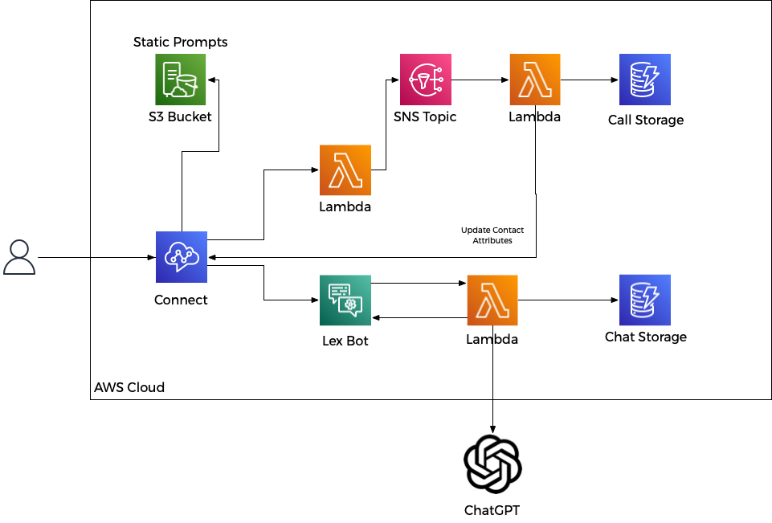

# AWS Connect ChatGPT via Lex in Java

## Background

This project demonstrates a full working model with UI that shows how to configure all of the resources to support calling Java [Lambda functions from AWS RDS Postgress](https://docs.aws.amazon.com/AmazonRDS/latest/UserGuide/PostgreSQL-Lambda.html).  If you're already a lambda guru and just want to see how to build some kind of payload in psql then simply take a look at the [Trigger function](src/main/resources/scripts/LambdaTriggerFuction.sql).

Why even use this feature?  If you have many code bases that are writing data to Postgres, then how do you ensure that downline processing is done correctly on all data.  We typically fire off lambdas directly in code or push the id of the record to SNS or SQS.  This all works fine if all the places you insert data call the correct downline function.  But sometimes you simply need to edit or update the data directly in Postico or even just plain SQL.  By having Postgres call the Lambda you completely decouple the downline logic from the part of the appplication that inserts/updates/deletes the data.

Things to consider:
- If you fire off lambdas for row updates that themselves update the DB then you can quickly exaust connection and lambda resources.  If you update 1000 rows then you could have hundreds of lambdas fire and connect to the DB bringing everything to a grinding halt.  Therefore you should set [concurrency limits](https://aws.amazon.com/blogs/compute/managing-aws-lambda-function-concurrency/) on these lambda functions in most cases.
- When you exceed the limit, you get a throttle on the lambda, and these will delay processing.  In some cases this is fine.  In the Geo coding use case we don't need the Geo coding to complete immediately, so it's OK.  In testing 1K+ row updates for Geo coding some row updates took over 1 minute to complete because of the retry back off.
- If you need smoother execution of the events, then consider using a simple NodeJS Lambda (that won't be throttled) that takes the event payload and puts it on a SQS queue that another Lambda will process from the queue.  See a NodeJS example of this in the [ForwardToSQS.js](ForwardToSQS.js) file.

Three use cases are covered in this demo:
- A Lambda([PostgresAddressTrigger.java](src/main/java/demo/PostgresAddressTrigger.java)) that will update the same row that the trigger is firing on.  In this case, we have an address table, and when addresses are inserted or updated, they will be geo-coded by the [AWS Location API](https://docs.aws.amazon.com/location/latest/APIReference/API_SearchPlaceIndexForText.html).  Special care is needed in this case to prevent recursive triggering of the function.
- A Lambda ([PostgresAuditLogTrigger.java](src/main/java/demo/PostgresAuditLogTrigger.java)) that will simply log all actions on the address table to an audit_log table.  As shown in some AWS examples, you could then simply put the payload onto a SNS Topic or SQS Queue for downline processing.
- A Lambda ([PostgresAuditLogTriggerSQS.java](src/main/java/demo/PostgresAuditLogTriggerSQS.java)) that will simply log all actions on the address table to an audit_log_sqs table.  This shows how to process the same event above from a SQS Queue.

Other goals of the project:
- SAM CloudFormation example for all the components in play (`sam build` and then `sam deploy`) for simple deployment of the project.
- Managed RDS Secret for connecting to the DB and use of the [AWS JDBC Driver](https://docs.aws.amazon.com/secretsmanager/latest/userguide/retrieving-secrets_jdbc.html).
- [Custom Resource](https://docs.aws.amazon.com/AWSCloudFormation/latest/UserGuide/template-custom-resources.html) to initialize the DB after creation ([CloudFormationCustomResource.java](src/main/java/demo/CloudFormationCustomResource.java)).  Namely to enable the lambda extensions and create all the SQL resources necessary in Postgres.
- Nested Stacks.
- To simply provide a full working example with Java and AWS RDS Postgres (what I use day to day).  The Demo on the AWS Website is MySQL with NodeJS and there was nothing I could find that really showed a full use case in Java.



## Contents
This project contains source code and supporting files for a serverless application that you can deploy with the SAM CLI. It includes the following files and folders.

- [/src/main/java/demo](src/main/java/demo) - Java Lambda Functions
- [/src/main/resources/scripts](src/main/resources/scripts) - SQL Scripts used to initialize the DB from the [Custom Resource](https://docs.aws.amazon.com/AWSCloudFormation/latest/UserGuide/template-custom-resources.html) ([CloudFormationCustomResource.java](src/main/java/demo/CloudFormationCustomResource.java)) in CloudFormation.
- CloudFormation scripts for all AWS resources
	- [vpc.yaml](vpc.yaml) - Creates simple VPC with 2 public subnets
	- [postgres.yaml](postgres.yaml) - Creates Auora Postgres Cluster with single serverlessV2 node and permissions to execute lambda functions.
	- [template.yaml](template.yaml) - Creates all the SAM lambda functions and associated AWS resources.


## Deploy the Demo

The Serverless Application Model Command Line Interface (SAM CLI) is an extension of the AWS CLI that adds functionality for building and testing Lambda applications. It uses Docker to run your functions in an Amazon Linux environment that matches Lambda. It can also emulate your application's build environment and API.  Before proceeding, it is assumed you have valid AWS credentials setup with the AWS CLI and permissions to perform CloudFormation stack operations.

To use the SAM CLI, you need the following tools.

* SAM CLI - [Install the SAM CLI](https://docs.aws.amazon.com/serverless-application-model/latest/developerguide/serverless-sam-cli-install.html)
* Java11 - [Install the Java 11](https://docs.aws.amazon.com/corretto/latest/corretto-11-ug/downloads-list.html)
* Maven - [Install Maven](https://maven.apache.org/install.html)

If you have brew installed then
```bash
brew install aws-sam-cli
brew install corretto11
brew install maven
```

To build and deploy, run the following in your shell after you have cloned the repo:

```bash
java-postgres-lambda-trigger$ sam build
java-postgres-lambda-trigger$ sam deploy
```

The first command will build the source of the application. The second command will package and deploy the demo application to AWS.  You will see the progress as the stack deploys, be patient as it does take a while to spin up the Aurora Cluster and serverless postgres node. `Do not forget to delete the stack or you will continue to incure AWS charges for the DB`.  


You can find the API Gateway Endpoint URL in the output values displayed after deployment.  Open the URL with a web browser.

## Play with the demo UI and observe the table entries


When you open the API GW Endpoint URL in your browser you will see the above UI.  When the DB initializes, one address row is inserted for you, so you should see 1 row with an address Geo encoded and 2 entries in the `audit_log` tables.  The UI displays all the rows in both `address` and `audit_log` tables.  There are four actions to perform in the demo:

- Add Row to Address Table - This adds Apple's HQ address to the table.  Normally after the refresh you would see the row without geo encoding.  If you then hit `Refresh`, you should see the Geo data populated into the row.
- Add 5 Rows to Address Table - This adds 5 different addresses to the table.  Normally after the refresh you would see the rows without geo encoding.  If you then hit `Refresh`, you should see the Geo data populated into the rows.  Due to throttling this last one might be delayed a little.
- Delete Last Address - This deletes the last address row from the `address` table.  You should see the last row go away and an `audit_log` row for the delete action.
- Refresh - Does a simple refresh of the page (which reads all the tables again)
- Clear Audit Log - Truncates the `audit_log` tables.

## Fetch, tail, and filter Lambda function logs

To simplify troubleshooting, SAM CLI has a command called `sam logs`. `sam logs` lets you fetch logs generated by the deployed Lambda functions from the command line. In addition to printing the logs on the terminal, this command has several nifty features to help you quickly see what's going on with the demo.


```bash
java-postgres-lambda-trigger$ sam logs --tail
```

You can find more information and examples about filtering Lambda function logs in the [SAM CLI Documentation](https://docs.aws.amazon.com/serverless-application-model/latest/developerguide/serverless-sam-cli-logging.html).


## Cleanup

To delete the demo, use the SAM CLI. `DO NOT FORGET TO RUN THIS OR YOU WILL CONTINUE TO BE CHARGED FOR AWS RESOURCES` (Namely the Aurora Postgres Cluster Node).  You can run the following:

```bash
java-postgres-lambda-trigger$ sam delete
```

## Sample Deploy Output
```bash
java-postgres-lambda-trigger$ sam deploy

		Managed S3 bucket: aws-sam-cli-managed-default-samclisourcebucket-13mtysy565mpu
		A different default S3 bucket can be set in samconfig.toml
		Or by specifying --s3-bucket explicitly.
File with same data already exists at 118b7556e1cd744803277e0663e0ed67.template, skipping upload
	Uploading to 010fb9709bddad387f7bb52fcb951137.template  3231 / 3231  (100.00%)
	Uploading to c40eaf68c93cc685332b62684f40581e  15662376 / 15662376  (100.00%)
File with same data already exists at c40eaf68c93cc685332b62684f40581e, skipping upload
File with same data already exists at c40eaf68c93cc685332b62684f40581e, skipping upload
File with same data already exists at c40eaf68c93cc685332b62684f40581e, skipping upload
File with same data already exists at c40eaf68c93cc685332b62684f40581e, skipping upload
File with same data already exists at c40eaf68c93cc685332b62684f40581e, skipping upload
File with same data already exists at c40eaf68c93cc685332b62684f40581e, skipping upload
	Uploading to d3853c519bc91a008dfe389fee6d07be  13999391 / 13999391  (100.00%)
File with same data already exists at c40eaf68c93cc685332b62684f40581e, skipping upload
File with same data already exists at c40eaf68c93cc685332b62684f40581e, skipping upload

	Deploying with following values
	===============================
	Stack name                   : postgres-lambda-trigger
	Region                       : us-east-1
	Confirm changeset            : True
	Disable rollback             : False
	Deployment s3 bucket         : aws-sam-cli-managed-default-samclisourcebucket-13mtysy565mpu
	Capabilities                 : ["CAPABILITY_IAM"]
	Parameter overrides          : {}
	Signing Profiles             : {}

Initiating deployment
=====================

	Uploading to ea29b7c6462387e6ec53070650e2ffbf.template  10410 / 10410  (100.00%)


Waiting for changeset to be created..

CloudFormation stack changeset
---------------------------------------------------------------------------------------------------------------------------------------------------------------------
Operation                                 LogicalResourceId                         ResourceType                              Replacement                             
---------------------------------------------------------------------------------------------------------------------------------------------------------------------
+ Add                                     ApiGatewayApiGatewayDefaultStage          AWS::ApiGatewayV2::Stage                  N/A                                     
+ Add                                     ApiGateway                                AWS::ApiGatewayV2::Api                    N/A                                     
+ Add                                     CreateAddressHelloWorldPermission         AWS::Lambda::Permission                   N/A                                     
+ Add                                     CreateAddressRole                         AWS::IAM::Role                            N/A                                     
+ Add                                     CreateAddress                             AWS::Lambda::Function                     N/A                                     
+ Add                                     DBCustom                                  Custom::DBInitialization                  N/A                                     
+ Add                                     DBInitializationEventInvokeConfig         AWS::Lambda::EventInvokeConfig            N/A                                     
+ Add                                     DBInitializationRole                      AWS::IAM::Role                            N/A                                     
+ Add                                     DBInitialization                          AWS::Lambda::Function                     N/A                                     
+ Add                                     DeleteAddressHelloWorldPermission         AWS::Lambda::Permission                   N/A                                     
+ Add                                     DeleteAddressRole                         AWS::IAM::Role                            N/A                                     
+ Add                                     DeleteAddress                             AWS::Lambda::Function                     N/A                                     
+ Add                                     DeleteAuditLogHelloWorldPermission        AWS::Lambda::Permission                   N/A                                     
+ Add                                     DeleteAuditLogRole                        AWS::IAM::Role                            N/A                                     
+ Add                                     DeleteAuditLog                            AWS::Lambda::Function                     N/A                                     
+ Add                                     FrontEndHelloWorldPermission              AWS::Lambda::Permission                   N/A                                     
+ Add                                     FrontEndRole                              AWS::IAM::Role                            N/A                                     
+ Add                                     FrontEnd                                  AWS::Lambda::Function                     N/A                                     
+ Add                                     GeoCodingPolicy                           AWS::IAM::ManagedPolicy                   N/A                                     
+ Add                                     MultipleAddressHelloWorldPermission       AWS::Lambda::Permission                   N/A                                     
+ Add                                     MultipleAddressRole                       AWS::IAM::Role                            N/A                                     
+ Add                                     MultipleAddress                           AWS::Lambda::Function                     N/A                                     
+ Add                                     PlaceIndex                                AWS::Location::PlaceIndex                 N/A                                     
+ Add                                     PostgresAddressTriggerEventInvokeConfig   AWS::Lambda::EventInvokeConfig            N/A                                     
+ Add                                     PostgresAddressTriggerRole                AWS::IAM::Role                            N/A                                     
+ Add                                     PostgresAddressTrigger                    AWS::Lambda::Function                     N/A                                     
+ Add                                     PostgresAuditLogTriggerEventInvokeConfi   AWS::Lambda::EventInvokeConfig            N/A                                     
                                          g                                                                                                                           
+ Add                                     PostgresAuditLogTriggerRole               AWS::IAM::Role                            N/A                                     
+ Add                                     PostgresAuditLogTriggerSQSRole            AWS::IAM::Role                            N/A                                     
+ Add                                     PostgresAuditLogTriggerSQSSQSQueue        AWS::Lambda::EventSourceMapping           N/A                                     
+ Add                                     PostgresAuditLogTriggerSQS                AWS::Lambda::Function                     N/A                                     
+ Add                                     PostgresAuditLogTrigger                   AWS::Lambda::Function                     N/A                                     
+ Add                                     RDSStack                                  AWS::CloudFormation::Stack                N/A                                     
+ Add                                     SQSQueue                                  AWS::SQS::Queue                           N/A                                     
+ Add                                     SecretsPolicy                             AWS::IAM::ManagedPolicy                   N/A                                     
+ Add                                     SendToSQSEventInvokeConfig                AWS::Lambda::EventInvokeConfig            N/A                                     
+ Add                                     SendToSQSRole                             AWS::IAM::Role                            N/A                                     
+ Add                                     SendToSQS                                 AWS::Lambda::Function                     N/A                                     
---------------------------------------------------------------------------------------------------------------------------------------------------------------------


Changeset created successfully. arn:aws:cloudformation:us-east-1::changeSet/samcli-deploy1679564646/e3451f71-d284-4784-b2de-665d79804510


Previewing CloudFormation changeset before deployment
======================================================
Deploy this changeset? [y/N]: y

2023-03-23 04:44:19 - Waiting for stack create/update to complete

CloudFormation events from stack operations (refresh every 0.5 seconds)
---------------------------------------------------------------------------------------------------------------------------------------------------------------------
ResourceStatus                            ResourceType                              LogicalResourceId                         ResourceStatusReason                    
---------------------------------------------------------------------------------------------------------------------------------------------------------------------
CREATE_IN_PROGRESS                        AWS::CloudFormation::Stack                RDSStack                                  -                                       
CREATE_IN_PROGRESS                        AWS::SQS::Queue                           SQSQueue                                  -                                       
CREATE_IN_PROGRESS                        AWS::Location::PlaceIndex                 PlaceIndex                                -                                       
CREATE_IN_PROGRESS                        AWS::CloudFormation::Stack                RDSStack                                  Resource creation Initiated             
CREATE_IN_PROGRESS                        AWS::SQS::Queue                           SQSQueue                                  Resource creation Initiated             
CREATE_IN_PROGRESS                        AWS::Location::PlaceIndex                 PlaceIndex                                Resource creation Initiated             
CREATE_COMPLETE                           AWS::Location::PlaceIndex                 PlaceIndex                                -                                       
CREATE_IN_PROGRESS                        AWS::IAM::ManagedPolicy                   GeoCodingPolicy                           -                                       
CREATE_IN_PROGRESS                        AWS::IAM::ManagedPolicy                   GeoCodingPolicy                           Resource creation Initiated             
CREATE_COMPLETE                           AWS::IAM::ManagedPolicy                   GeoCodingPolicy                           -                                       
CREATE_COMPLETE                           AWS::SQS::Queue                           SQSQueue                                  -                                       
CREATE_IN_PROGRESS                        AWS::IAM::Role                            SendToSQSRole                             -                                       
CREATE_IN_PROGRESS                        AWS::IAM::Role                            SendToSQSRole                             Resource creation Initiated             
CREATE_COMPLETE                           AWS::IAM::Role                            SendToSQSRole                             -                                       
CREATE_IN_PROGRESS                        AWS::Lambda::Function                     SendToSQS                                 -                                       
CREATE_IN_PROGRESS                        AWS::Lambda::Function                     SendToSQS                                 Resource creation Initiated             
CREATE_COMPLETE                           AWS::Lambda::Function                     SendToSQS                                 -                                       
CREATE_IN_PROGRESS                        AWS::Lambda::EventInvokeConfig            SendToSQSEventInvokeConfig                -                                       
CREATE_IN_PROGRESS                        AWS::Lambda::EventInvokeConfig            SendToSQSEventInvokeConfig                Resource creation Initiated             
CREATE_COMPLETE                           AWS::Lambda::EventInvokeConfig            SendToSQSEventInvokeConfig                -                                       
CREATE_COMPLETE                           AWS::CloudFormation::Stack                RDSStack                                  -                                       
CREATE_IN_PROGRESS                        AWS::IAM::ManagedPolicy                   SecretsPolicy                             -                                       
CREATE_IN_PROGRESS                        AWS::IAM::ManagedPolicy                   SecretsPolicy                             Resource creation Initiated             
CREATE_COMPLETE                           AWS::IAM::ManagedPolicy                   SecretsPolicy                             -                                       
CREATE_IN_PROGRESS                        AWS::IAM::Role                            DBInitializationRole                      -                                       
CREATE_IN_PROGRESS                        AWS::IAM::Role                            PostgresAuditLogTriggerSQSRole            -                                       
CREATE_IN_PROGRESS                        AWS::IAM::Role                            CreateAddressRole                         -                                       
CREATE_IN_PROGRESS                        AWS::IAM::Role                            MultipleAddressRole                       -                                       
CREATE_IN_PROGRESS                        AWS::IAM::Role                            DeleteAuditLogRole                        -                                       
CREATE_IN_PROGRESS                        AWS::IAM::Role                            PostgresAuditLogTriggerRole               -                                       
CREATE_IN_PROGRESS                        AWS::IAM::Role                            DBInitializationRole                      Resource creation Initiated             
CREATE_IN_PROGRESS                        AWS::IAM::Role                            DeleteAddressRole                         -                                       
CREATE_IN_PROGRESS                        AWS::IAM::Role                            FrontEndRole                              -                                       
CREATE_IN_PROGRESS                        AWS::IAM::Role                            PostgresAuditLogTriggerSQSRole            Resource creation Initiated             
CREATE_IN_PROGRESS                        AWS::IAM::Role                            MultipleAddressRole                       Resource creation Initiated             
CREATE_IN_PROGRESS                        AWS::IAM::Role                            CreateAddressRole                         Resource creation Initiated             
CREATE_IN_PROGRESS                        AWS::IAM::Role                            DeleteAuditLogRole                        Resource creation Initiated             
CREATE_IN_PROGRESS                        AWS::IAM::Role                            PostgresAuditLogTriggerRole               Resource creation Initiated             
CREATE_IN_PROGRESS                        AWS::IAM::Role                            FrontEndRole                              Resource creation Initiated             
CREATE_IN_PROGRESS                        AWS::IAM::Role                            PostgresAddressTriggerRole                -                                       
CREATE_IN_PROGRESS                        AWS::IAM::Role                            DeleteAddressRole                         Resource creation Initiated             
CREATE_IN_PROGRESS                        AWS::IAM::Role                            PostgresAddressTriggerRole                Resource creation Initiated             
CREATE_COMPLETE                           AWS::IAM::Role                            MultipleAddressRole                       -                                       
CREATE_COMPLETE                           AWS::IAM::Role                            DBInitializationRole                      -                                       
CREATE_COMPLETE                           AWS::IAM::Role                            DeleteAuditLogRole                        -                                       
CREATE_COMPLETE                           AWS::IAM::Role                            PostgresAuditLogTriggerSQSRole            -                                       
CREATE_COMPLETE                           AWS::IAM::Role                            PostgresAuditLogTriggerRole               -                                       
CREATE_COMPLETE                           AWS::IAM::Role                            FrontEndRole                              -                                       
CREATE_COMPLETE                           AWS::IAM::Role                            DeleteAddressRole                         -                                       
CREATE_COMPLETE                           AWS::IAM::Role                            PostgresAddressTriggerRole                -                                       
CREATE_COMPLETE                           AWS::IAM::Role                            CreateAddressRole                         -                                       
CREATE_IN_PROGRESS                        AWS::Lambda::Function                     DeleteAuditLog                            -                                       
CREATE_IN_PROGRESS                        AWS::Lambda::Function                     DBInitialization                          -                                       
CREATE_IN_PROGRESS                        AWS::Lambda::Function                     FrontEnd                                  -                                       
CREATE_IN_PROGRESS                        AWS::Lambda::Function                     MultipleAddress                           -                                       
CREATE_IN_PROGRESS                        AWS::Lambda::Function                     PostgresAuditLogTriggerSQS                -                                       
CREATE_IN_PROGRESS                        AWS::Lambda::Function                     PostgresAuditLogTrigger                   -                                       
CREATE_IN_PROGRESS                        AWS::Lambda::Function                     DeleteAddress                             -                                       
CREATE_IN_PROGRESS                        AWS::Lambda::Function                     PostgresAddressTrigger                    -                                       
CREATE_IN_PROGRESS                        AWS::Lambda::Function                     CreateAddress                             -                                       
CREATE_IN_PROGRESS                        AWS::Lambda::Function                     DeleteAuditLog                            Resource creation Initiated             
CREATE_IN_PROGRESS                        AWS::Lambda::Function                     MultipleAddress                           Resource creation Initiated             
CREATE_IN_PROGRESS                        AWS::Lambda::Function                     FrontEnd                                  Resource creation Initiated             
CREATE_IN_PROGRESS                        AWS::Lambda::Function                     PostgresAuditLogTriggerSQS                Resource creation Initiated             
CREATE_IN_PROGRESS                        AWS::Lambda::Function                     PostgresAddressTrigger                    Resource creation Initiated             
CREATE_IN_PROGRESS                        AWS::Lambda::Function                     DBInitialization                          Resource creation Initiated             
CREATE_IN_PROGRESS                        AWS::Lambda::Function                     PostgresAuditLogTrigger                   Resource creation Initiated             
CREATE_IN_PROGRESS                        AWS::Lambda::Function                     CreateAddress                             Resource creation Initiated             
CREATE_IN_PROGRESS                        AWS::Lambda::Function                     DeleteAddress                             Resource creation Initiated             
CREATE_COMPLETE                           AWS::Lambda::Function                     DeleteAuditLog                            -                                       
CREATE_COMPLETE                           AWS::Lambda::Function                     FrontEnd                                  -                                       
CREATE_COMPLETE                           AWS::Lambda::Function                     MultipleAddress                           -                                       
CREATE_COMPLETE                           AWS::Lambda::Function                     DBInitialization                          -                                       
CREATE_COMPLETE                           AWS::Lambda::Function                     CreateAddress                             -                                       
CREATE_COMPLETE                           AWS::Lambda::Function                     PostgresAddressTrigger                    -                                       
CREATE_COMPLETE                           AWS::Lambda::Function                     PostgresAuditLogTrigger                   -                                       
CREATE_COMPLETE                           AWS::Lambda::Function                     DeleteAddress                             -                                       
CREATE_COMPLETE                           AWS::Lambda::Function                     PostgresAuditLogTriggerSQS                -                                       
CREATE_IN_PROGRESS                        AWS::Lambda::EventInvokeConfig            DBInitializationEventInvokeConfig         -                                       
CREATE_IN_PROGRESS                        AWS::Lambda::EventInvokeConfig            PostgresAddressTriggerEventInvokeConfig   -                                       
CREATE_IN_PROGRESS                        Custom::DBInitialization                  DBCustom                                  -                                       
CREATE_IN_PROGRESS                        AWS::Lambda::EventInvokeConfig            PostgresAuditLogTriggerEventInvokeConfi   -                                       
                                                                                    g                                                                                 
CREATE_IN_PROGRESS                        AWS::Lambda::EventSourceMapping           PostgresAuditLogTriggerSQSSQSQueue        -                                       
CREATE_IN_PROGRESS                        AWS::ApiGatewayV2::Api                    ApiGateway                                -                                       
CREATE_IN_PROGRESS                        AWS::Lambda::EventInvokeConfig            DBInitializationEventInvokeConfig         Resource creation Initiated             
CREATE_IN_PROGRESS                        AWS::Lambda::EventInvokeConfig            PostgresAddressTriggerEventInvokeConfig   Resource creation Initiated             
CREATE_IN_PROGRESS                        AWS::Lambda::EventInvokeConfig            PostgresAuditLogTriggerEventInvokeConfi   Resource creation Initiated             
                                                                                    g                                                                                 
CREATE_COMPLETE                           AWS::Lambda::EventInvokeConfig            PostgresAddressTriggerEventInvokeConfig   -                                       
CREATE_COMPLETE                           AWS::Lambda::EventInvokeConfig            DBInitializationEventInvokeConfig         -                                       
CREATE_COMPLETE                           AWS::Lambda::EventInvokeConfig            PostgresAuditLogTriggerEventInvokeConfi   -                                       
                                                                                    g                                                                                 
CREATE_IN_PROGRESS                        AWS::Lambda::EventSourceMapping           PostgresAuditLogTriggerSQSSQSQueue        Resource creation Initiated             
CREATE_IN_PROGRESS                        AWS::ApiGatewayV2::Api                    ApiGateway                                Resource creation Initiated             
CREATE_COMPLETE                           AWS::ApiGatewayV2::Api                    ApiGateway                                -                                       
CREATE_IN_PROGRESS                        AWS::Lambda::Permission                   DeleteAddressHelloWorldPermission         -                                       
CREATE_IN_PROGRESS                        AWS::Lambda::Permission                   CreateAddressHelloWorldPermission         -                                       
CREATE_IN_PROGRESS                        AWS::ApiGatewayV2::Stage                  ApiGatewayApiGatewayDefaultStage          -                                       
CREATE_IN_PROGRESS                        AWS::Lambda::Permission                   MultipleAddressHelloWorldPermission       -                                       
CREATE_IN_PROGRESS                        AWS::Lambda::Permission                   DeleteAuditLogHelloWorldPermission        -                                       
CREATE_IN_PROGRESS                        AWS::Lambda::Permission                   FrontEndHelloWorldPermission              -                                       
CREATE_IN_PROGRESS                        AWS::Lambda::Permission                   DeleteAddressHelloWorldPermission         Resource creation Initiated             
CREATE_IN_PROGRESS                        AWS::Lambda::Permission                   DeleteAuditLogHelloWorldPermission        Resource creation Initiated             
CREATE_IN_PROGRESS                        AWS::Lambda::Permission                   MultipleAddressHelloWorldPermission       Resource creation Initiated             
CREATE_IN_PROGRESS                        AWS::Lambda::Permission                   FrontEndHelloWorldPermission              Resource creation Initiated             
CREATE_IN_PROGRESS                        AWS::Lambda::Permission                   CreateAddressHelloWorldPermission         Resource creation Initiated             
CREATE_IN_PROGRESS                        AWS::ApiGatewayV2::Stage                  ApiGatewayApiGatewayDefaultStage          Resource creation Initiated             
CREATE_COMPLETE                           AWS::ApiGatewayV2::Stage                  ApiGatewayApiGatewayDefaultStage          -                                       
CREATE_IN_PROGRESS                        Custom::DBInitialization                  DBCustom                                  Resource creation Initiated             
CREATE_COMPLETE                           Custom::DBInitialization                  DBCustom                                  -                                       
CREATE_COMPLETE                           AWS::Lambda::Permission                   DeleteAddressHelloWorldPermission         -                                       
CREATE_COMPLETE                           AWS::Lambda::Permission                   CreateAddressHelloWorldPermission         -                                       
CREATE_COMPLETE                           AWS::Lambda::Permission                   FrontEndHelloWorldPermission              -                                       
CREATE_COMPLETE                           AWS::Lambda::Permission                   DeleteAuditLogHelloWorldPermission        -                                       
CREATE_COMPLETE                           AWS::Lambda::Permission                   MultipleAddressHelloWorldPermission       -                                       
CREATE_COMPLETE                           AWS::Lambda::EventSourceMapping           PostgresAuditLogTriggerSQSSQSQueue        -                                       
CREATE_COMPLETE                           AWS::CloudFormation::Stack                postgres-lambda-trigger                   -                                       
---------------------------------------------------------------------------------------------------------------------------------------------------------------------

CloudFormation outputs from deployed stack
-----------------------------------------------------------------------------------------------------------------------------------------------------------------------
Outputs                                                                                                                                                               
-----------------------------------------------------------------------------------------------------------------------------------------------------------------------
Key                 DBName                                                                                                                                            
Description         DB Name                                                                                                                                           
Value               demo                                                                                                                                              

Key                 ApiEndpoint                                                                                                                                       
Description         API Gateway endpoint URL, Open Browser to this to see demo                                                                                        
Value               https://2h5pzz1g9b.execute-api.us-east-1.amazonaws.com                                                                                            

Key                 DBEndpoint                                                                                                                                        
Description         DB Endpoint                                                                                                                                       
Value               postgres-lambda-trigger-rdssta-serverlessv2cluster-tpbn5iezfclk.cluster-cmkcbj80dwz4.us-east-1.rds.amazonaws.com                                  

Key                 DBURL                                                                                                                                             
Description         JDBC Connection URL                                                                                                                               
Value               jdbc:postgresql://postgres-lambda-trigger-rdssta-serverlessv2cluster-tpbn5iezfclk.cluster-cmkcbj80dwz4.us-east-1.rds.amazonaws.com/demo           

Key                 DBUsername                                                                                                                                        
Description         DB Username                                                                                                                                       
Value               master                                                                                                                                            
-----------------------------------------------------------------------------------------------------------------------------------------------------------------------


Successfully created/updated stack - postgres-lambda-trigger in us-east-1
```
